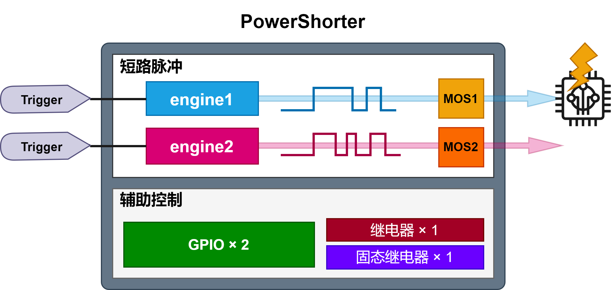
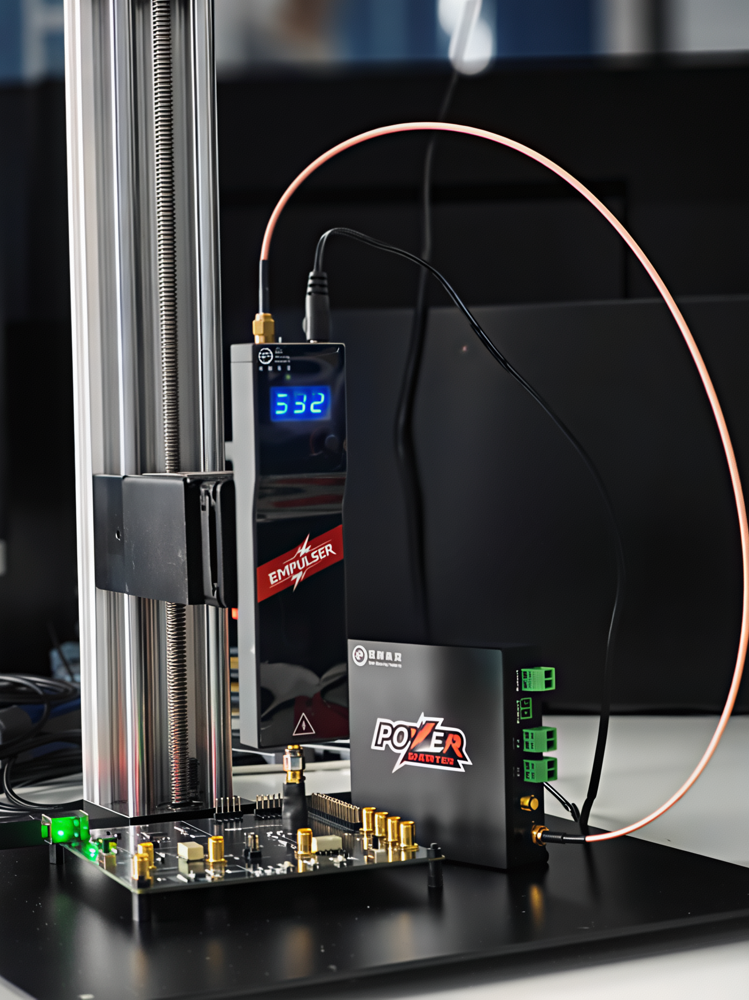
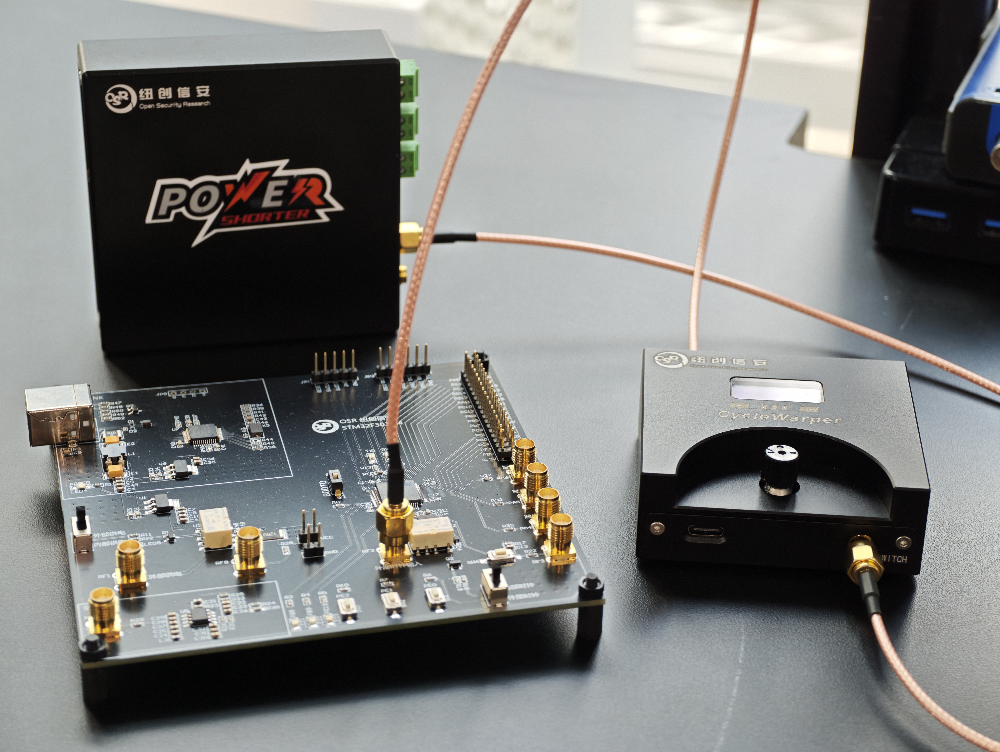

# PowerShorter


Some publicly available links:
- [PowerShorter Unboxing Guide](https://yichen115.github.io/%E4%B8%8A%E6%89%8B%E6%8C%87%E5%8D%97/PowerShorter%E5%BC%80%E7%AE%B1%E4%B8%8E%E7%AE%80%E5%8D%95%E4%BD%BF%E7%94%A8/)


> **Search for "深圳市纽创信安科技开发有限公司" (Shenzhen Nucstar Technology Development Co., Ltd.) on Taobao — the enterprise store lets you purchase the device.**


## Product Overview



PowerShorter is a dedicated device built for voltage short-circuit fault injection attack testing. With PowerShorter you can momentarily short-circuit the device under test, disrupting its normal operation.

PowerShorter has two independent short-circuit engines. Each engine listens for a trigger and outputs a precise level-pulse pattern control; these level-pulse patterns achieve a momentary short circuit as they pass through high-speed MOSFETs.

PowerShorter integrates one relay, one solid-state relay, and two GPIOs, used for automated control such as rebooting the device under test.



PowerShorter can use the `SMA-E1` and `SMA-E2` interfaces to drive the electromagnetic pulser `EMPulser`, together enabling electromagnetic pulse fault injection.



PowerShorter can use the `SMA-E1` and `SMA-E2` interfaces to drive the clock fault injector `Cyclewarper`, together enabling clock fault injection.

If you want visualized display of fault results, refer to the [FaultViz project](https://github.com/OSR-Lab/faultviz).

### Device Specifications
- Pulse control precision: 10ns
- Maximum number of configurable short-circuit pulse patterns: 8
- Maximum pattern repeat count: 256
- GPIO outputs: 2 channels (3.3V)
- Relay output: 1 channel, max input 50V 7A
- Solid-state relay output: 1 channel, bidirectional max input 12V 3A
- Trigger modes:
  + Edge trigger
  + Manual trigger
  + Edge-count trigger

### Short-Circuit Fault Usage Example
```python
import power_shorter as ps

ps_dev = ps.PowerShorter('com4') # select the serial port
ps_dev.gpio(ps.GPIO.GPIO1, 0)    # control GPIO1 to output a low level
ps_dev.relay(ps.RELAY.RELAY1, 0) # open RELAY1; RELAY1 is the solid-state relay
ps_dev.relay(ps.RELAY.RELAY2, 0) # open RELAY2; RELAY2 is the mechanical relay

ps_dev.engine_cfg(ps.Engine.E1, [(0, 200), (1, 100), (0, 100), (1, 23), (0, 1)])  # use the trigger_mode parameter to control the trigger mode, and pattern_repeat to control glitch repetition

ps_dev.arm(ps.Engine.E1)
s = ps_dev.state(ps.Engine.E1)
assert s == 'armed'
... # wait for the rising edge to complete the trigger
assert s == 'glitched'
```
The key call in the code above is `engine_cfg`. In this example, the rising edge is used as the trigger event. After the event occurs, it waits 2000ns, then short-circuits for 1000ns, then waits another 1000ns, then short-circuits for 230ns, and finally returns to the normal state. This is equivalent to performing two short-circuit fault injections on the target device. The pattern list supports at most 8 states. The `trigger_mode` parameter can switch the trigger event between rising edge / falling edge, and the `pattern_repeat` parameter can control how many times the pattern list is repeated. For example, in this example, if `pattern_repeat` is set to 2, the pattern is repeated twice, i.e. 4 short-circuit fault injections are performed. By setting `trigger_edges`, multiple edges can be monitored as the trigger event; `trigger_edges` is useful when using some bus protocol communication (such as UART) as the trigger event.

### Example of Driving EMPulser for Electromagnetic Fault Injection
```python
import power_shorter as ps

em_dev = ps.EMPulser('com4') # select the serial port
em_dev.gpio(ps.GPIO.GPIO1, 0)    # control GPIO1 to output a low level
em_dev.relay(ps.RELAY.RELAY1, 0) # open RELAY1; RELAY1 is the solid-state relay
em_dev.relay(ps.RELAY.RELAY2, 0) # open RELAY2; RELAY2 is the mechanical relay

em_dev.engine_cfg(ps.Engine.E1, delay=10, pulse=2, trigger_mode=ps.TRIGGER_MODE.RISE, trigger_edges=1)  # use the trigger_mode parameter to control the trigger mode, and trigger_edges to set the trigger count
em_dev.arm(ps.Engine.E1)
s = em_dev.state(ps.Engine.E1)
assert s == 'armed'
... # wait for the rising edge to complete the trigger
assert s == 'glitched'
```
The key call in the code above is `engine_cfg`. In this example, the rising edge is used as the trigger event. After the event occurs, it waits 100ns, then PowerShorter drives EMPulser to emit a `20ns` electromagnetic pulse (EMPulser's output pulse width ranges from `10ns~80ns`).

### Example of Driving Cyclewarper for Clock Fault Injection
```python
import power_shorter as ps

cw_dev = ps.CycleWarper('com4') # select the serial port
cw_dev.gpio(ps.GPIO.GPIO1, 0)    # control GPIO1 to output a low level
cw_dev.relay(ps.RELAY.RELAY1, 0) # open RELAY1; RELAY1 is the solid-state relay
cw_dev.relay(ps.RELAY.RELAY2, 0) # open RELAY2; RELAY2 is the mechanical relay

cw_dev.engine_cfg(ps.Engine.E1, delay=10, pulse=5, trigger_mode=ps.TRIGGER_MODE.RISE, trigger_edges=1)  # use the trigger_mode parameter to control the trigger mode, and trigger_edges to set the trigger count
cw_dev.arm(ps.Engine.E1)
s = cw_dev.state(ps.Engine.E1)
assert s == 'armed'
... # wait for the rising edge to complete the trigger
assert s == 'glitched'
```
The key call in the code above is `engine_cfg`. In this example, the rising edge is used as the trigger event. After the event occurs, it waits 100ns, then PowerShorter drives Cyclewarper through the `SMA-E1`/`SMA-E2` interface to output a `50ns` clock fault pulse, disturbing the target device's clock line. Both `delay` and `pulse` are in units of `10ns`.

## Complete OSR-303 for-loop Fault Example
Using the OSR-303 development board, we provide a complete OSR-303 FORLOOP fault injection example:

>[Voltage Fault](https://github.com/OSR-Lab/osr-303/blob/main/vcc-fault_example.ipynb)

>[Electromagnetic Fault](https://github.com/OSR-Lab/osr-303/blob/main/em-fault_example.ipynb)

>[Clock Fault](https://github.com/OSR-Lab/osr-303/blob/main/clk-fault_example.ipynb)
